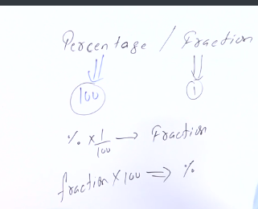
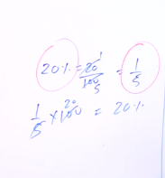
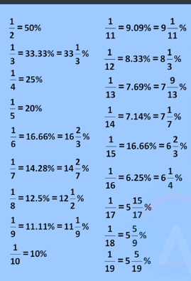
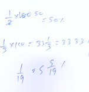
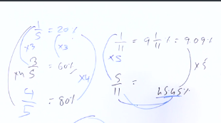

# *Percentage / Fraction*

What is Building of Arthametics?

> This is Arthamethic building but this Arthamethic bulding set only in two pillar first pillar is **Percentage** and second pillar is **Ratio** we are understand this two pillar then the king of Arthametic.

---

What is Percentage?

> per cent age cent is a freanch word freanch mean 100 any thing you respect in 100 and compersion any thing any itmes that is called Percentage. any thing in the world **repersent on 100%**.

What is Fraction?

> Fraction will be repersent 1 any thing you denote percentage or you denote fraction or depend data in the question what will say data in the question and solve this question.**Percentage and Fraction is one and same element**
---

#### **Percentage and Fraction**

> **Percentage will be repersent 100 and Fraction will be repersent 1**you and me Percentage divied by fraction that is called fraction. But Fraction multiply by percentage that is called Percentage.

Example => 

20% = 20 by 100 = 1 by 5 but 1 by 5 is fraction.

1 by 5 x 100  20% but 20% is percentage

---

### *Table*

>this is Percentage and Fraction table you learn this table then we can solve question easily this table is most imprtant 

#### Example =>

> question is 1 by 2 but 1 by 2 is fraction then answer 1 by 2 / by 100 then ans is 50 but what is 50 ? all freinds listen 50 is percentage beacuse 1 by 2 is fraction /  100 persent then ans give 50% you not understand this question then check top second image then this question you understanding esily. Next question is 1 by 3 but 1 by 3 is fraction then 3 / 100 = this ans is fraction=> 33 , 1 by 3 = and this ans is percentage  33.33%. Next question is 1 by 19  then 19 / 100 then ans is 5 into 5 by 9

> question will give 1 by 5 this simple question 1 by 5 / 100 then ans is 20% but but second question give 3 by 5 then 5 / 100 = 20% but question is 3 by 5 then 20 + 20 + 20 ans is 60% . 3 by 5 /100 = 60%.Next question give 4 by 5 then 5 / 100 = 4 x 20% = 80% very easy question we use mind

## *table* 
### tTwo table in Percentage 

|  question      |   Answer   |
|----------------|------------|
| 1 by 2         |   50%      |
| 2 by 2         |   100%     |
| 3 by 2         |   150%     |
| 4 by 2         |   200%     |
| 5 by 2         |   250%     |
| 6 by 2         |   300%     |
| 7 by 2         |   350%     |
| 8 by 2         |   400%     |
| 9 by 2         |   450%     |
| 10 by 2        |   500%     |

---

### Three table in Percentage

|  question    |     Answer   |
|--------------|--------------|
| 1 by 3       |   33.33      |
| 2 by 3       |   66.66      |
| 3 by 3       |   99.99      |
| 4 by 3       |   133.32     |
| 5 by 3       |   166.65     |
| 6 by 3       |   199.98     |
| 7 by 3       |   232.98     |
| 8 by 3       |   265.98     |
| 9 by 3       |   298.98     |
| 10 by 3      |   331.98     |

---

### Four table in Percentage

|  question    |     Answer   |
|--------------|--------------|
| 1 by 4       |   25%        |
| 2 by 4       |   50%        |
| 3 by 4       |   75%        |
| 4 by 4       |   100%       |
| 5 by 4       |   125%       |
| 6 by 4       |   150%       |
| 7 by 4       |   175%       |
| 8 by 4       |   200%       |
| 9 by 4       |   225        |
| 10 by 4      |   250        |

---

### Five table in Percentage

|  question    |     Answer   |
|--------------|--------------|
| 1 by 5       |   20%        |
| 2 by 5       |   40%        |
| 3 by 5       |   60%        |
| 4 by 5       |   80%        |
| 5 by 5       |   100%       |
| 6 by 5       |   120%       |
| 7 by 5       |   140%       |
| 8 by 5       |   160%       |
| 9 by 5       |   180%       |
| 10 by 5      |   200%       |

---

### Six table in Percentage

|  question    |     Answer   |
|--------------|--------------|
| 1 by 6       |   16.66%     |
| 2 by 6       |   33.32%     |
| 3 by 6       |   49.98%     |
| 4 by 6       |   66.64%     |
| 5 by 6       |   83.3%      |
| 6 by 6       |   99.96%     |
| 7 by 6       |   116.62%    |
| 8 by 6       |   133.28%    |
| 9 by 6       |   149.94%    |
| 10 by 6      |   166.6      |

---

### Seven table in Percentage

|  question    |     Answer   |
|--------------|--------------|
| 1 by 7       |   14.28%     |
| 2 by 7       |   28.56%     |
| 3 by 7       |   42.84%     |
| 4 by 7       |   57.12%     |
| 5 by 7       |   71.40%     |
| 6 by 7       |   85.68%     |
| 7 by 7       |   99.96%     |
| 8 by 7       |   114.24%    |
| 9 by 7       |   128.52%    |
| 10 by 7      |   156.52%    |

---

### Eight table in Percentage

|  question    |     Answer   |
|--------------|--------------|
| 1 by 8       |   12.5%      |
| 2 by 8       |   25%        |
| 3 by 8       |   37.5%      |
| 4 by 8       |   50%        |
| 5 by 8       |   62.5%      |
| 6 by 8       |   75%        |
| 7 by 8       |   87.5%      |
| 8 by 8       |   100%       |
| 9 by 8       |   112.5%     |
| 10 by 8      |   125%       |

---

### Nine table in Percentage

|  question    |     Answer   |
|--------------|--------------|
| 1 by 9       |   11.11%     |
| 2 by 9       |   22.22%     |
| 3 by 9       |   33.33%     |
| 4 by 9       |   44.44%     |
| 5 by 9       |   55.55%     |
| 6 by 9       |   66.66%     |
| 7 by 9       |   77.77%     |
| 8 by 9       |   88.88%     |
| 9 by 9       |   99.99%     |
| 10 by 9      |   111.10%    |

---

### Ten table in Percentage

|  question    |     Answer   |
|--------------|--------------|
| 1 by 10      |   10%        |
| 2 by 10      |   20%        |
| 3 by 10      |   30%        |
| 4 by 10      |   40%        |
| 5 by 10      |   50%        |
| 6 by 10      |   60%        |
| 7 by 10      |   70%        |
| 8 by 10      |   80%        |
| 9 by 10      |   90%        |
| 10 by 10     |   100%       |

----

### Eleven table in Percentage

|  question    |     Answer   |
|--------------|--------------|
| 1 by 11      |   9.09%      |
| 2 by 11      |   20.09%     |
| 3 by 11      |   31.09%     |
| 4 by 11      |   42.09%     |
| 5 by 11      |   53.09%     |
| 6 by 11      |   64.09%     |
| 7 by 11      |   75.09%     |
| 8 by 11      |   86.09%     |
| 9 by 11      |   97.09%     |
| 10 by 11     |   108.09%    |

---

### Twelve table in Percentage

|  question    |     Answer   |
|--------------|--------------|
| 1 by 12      |   8.33%      |
| 2 by 12      |   20.09%     |
| 3 by 12      |   32.33%     |
| 4 by 12      |   44.33%     |
| 5 by 12      |   56.33%     |
| 6 by 12      |   68.33%     |
| 7 by 12      |   80.33%     |
| 8 by 12      |   92.33%     |
| 9 by 12      |   104.33%    |
| 10 by 12     |   116.33%    |

---

### Thirteen table in Percentage

|  question    |     Answer   |
|--------------|--------------|
| 1 by 13      |   7.69%      |
| 2 by 13      |   20.69%     |
| 3 by 13      |   33.69%     |
| 4 by 13      |   46.69%     |
| 5 by 13      |   59.69%     |
| 6 by 13      |   72.69%     |
| 7 by 13      |   85.69%     |
| 8 by 13      |   98.69%     |
| 9 by 13      |   111.69%    |
| 10 by 13     |   124.69%    |

---

### Forteen table in Percentage

|  question    |     Answer   |
|--------------|--------------|
| 1 by 14      |   7.14%      |
| 2 by 14      |   21.14%     |
| 3 by 14      |   35.14%     |
| 4 by 14      |   49.14%     |
| 5 by 14      |   63.14%     |
| 6 by 14      |   77.14%     |
| 7 by 14      |   91.14%     |
| 8 by 14      |   105.14%    |
| 9 by 14      |   119.14%    |
| 10 by 14     |   133.14%    |

---

### Fifteen table in Percentage

|  question    |     Answer   |
|--------------|--------------|
| 1 by 15      |   6.66%      |
| 2 by 15      |   21.66%     |
| 3 by 15      |   36.66%     |
| 4 by 15      |   51.66%     |
| 5 by 15      |   66.66%     |
| 6 by 15      |   81.66%     |
| 7 by 15      |   96.66%     |
| 8 by 15      |   111.66%    |
| 9 by 15      |   126.66%    |
| 10 by 15     |   141.66%    |

---

### Sixteen table in Percentage

|  question    |     Answer   |
|--------------|--------------|
| 1 by 16      |   6.25%      |
| 2 by 16      |   22.25%     |
| 3 by 16      |   38.25%     |
| 4 by 16      |   54.25%     |
| 5 by 16      |   70.25%     |
| 6 by 16      |   86.25%     |
| 7 by 16      |   102.25%    |
| 8 by 16      |   118.25%    |
| 9 by 16      |   134.25%    |
| 10 by 16     |   150.25%    |

---

### Seventeen table in Percentage

|  question    |     Answer   |
|--------------|--------------|
| 1 by 17      |   5.88%      |
| 2 by 17      |   22.88%     |
| 3 by 17      |   39.88%     |
| 4 by 17      |   56.88%     |
| 5 by 17      |   73.88%     |
| 6 by 17      |   90.88%     |
| 7 by 17      |   107.88%    |
| 8 by 17      |   124.88%    |
| 9 by 17      |   141.88%    |
| 10 by 17     |   158.88%    |

---

### Eighteen table in Percentage

|  question    |     Answer   |
|--------------|--------------|
| 1 by 18      |   5.55%      |
| 2 by 18      |   23.55%     |
| 3 by 18      |   41.55%     |
| 4 by 18      |   59.55%     |
| 5 by 18      |   77.55%     |
| 6 by 18      |   95.55%     |
| 7 by 18      |   133.55%    |
| 8 by 18      |   131.55%    |
| 9 by 18      |   149.55%    |
| 10 by 18     |   167.55%    |

---

### Nineteen table in Percentage

|  question    |     Answer   |
|--------------|--------------|
| 1 by 19      |   5.26%      |
| 2 by 19      |   24.26%     |
| 3 by 19      |   43.26%     |
| 4 by 19      |   62.26%     |
| 5 by 19      |   81.26%     |
| 6 by 19      |   100.26%    |
| 7 by 19      |   119.26%    |
| 8 by 19      |   138.26%    |
| 9 by 19      |   157.26%    |
| 10 by 19     |   176.26%%   |

---

### Twenteen table in Percentage

|  question    |     Answer   |
|--------------|--------------|
| 1 by 20      |   5%         |
| 2 by 20      |   25%        |
| 3 by 20      |   45%        |
| 4 by 20      |   65%        |
| 5 by 20      |   85%        |
| 6 by 20      |   105%       |
| 7 by 20      |   125%       |
| 8 by 20      |   145%       |
| 9 by 20      |   165%       |
| 10 by 20     |   185%       |