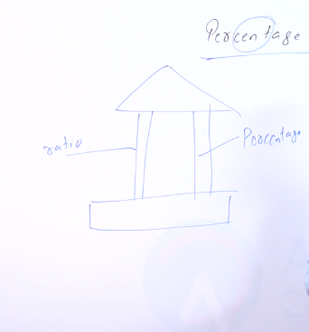
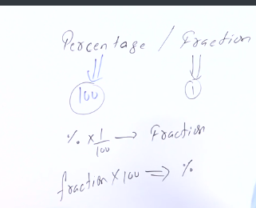
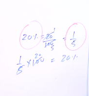
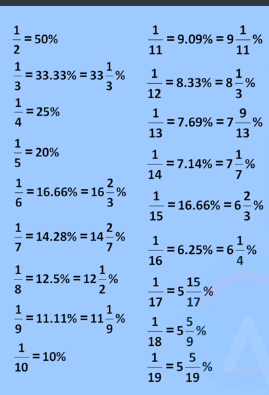
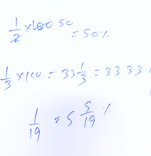
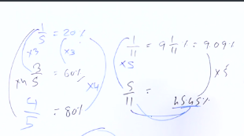

# *Percentage / Fraction*

What is Building of Arthametics?

> This is Arthamethic building but this Arthamethic bulding set only in two pillar first pillar is **Percentage** and second pillar is **Ratio** we are understand this two pillar then the king of Arthametic.

---

What is Percentage?

> per cent age cent is a freanch word freanch mean 100 any thing you respect in 100 and compersion any thing any itmes that is called Percentage. any thing in the world **repersent on 100%**.

What is Fraction?

> Fraction will be repersent 1 any thing you denote percentage or you denote fraction or depend data in the question what will say data in the question and solve this question.**Percentage and Fraction is one and same element**
---

#### **Percentage and Fraction**

> **Percentage will be repersent 100 and Fraction will be repersent 1**you and me Percentage divied by fraction that is called fraction. But Fraction multiply by percentage that is called Percentage.

Example => 

20% = 20 by 100 = 1 by 5 but 1 by 5 is fraction.

1 by 5 x 100  20% but 20% is percentage

---

### *Table*

>this is Percentage and Fraction table you learn this table then we can solve question easily this table is most imprtant 

#### Example =>

> question is 1 by 2 but 1 by 2 is fraction then answer 1 by 2 / by 100 then ans is 50 but what is 50 ? all freinds listen 50 is percentage beacuse 1 by 2 is fraction /  100 persent then ans give 50% you not understand this question then check top second image then this question you understanding esily. Next question is 1 by 3 but 1 by 3 is fraction then 3 / 100 = this ans is fraction=> 33 , 1 by 3 = and this ans is percentage  33.33%. Next question is 1 by 19  then 19 / 100 then ans is 5 into 5 by 9

> question will give 1 by 5 this simple question 1 by 5 / 100 then ans is 20% but but second question give 3 by 5 then 5 / 100 = 20% but question is 3 by 5 then 20 + 20 + 20 ans is 60% . 3 by 5 /100 = 60%.Next question give 4 by 5 then 5 / 100 = 4 x 20% = 80% very easy question we use mind

## *table* 
### two table in Percentage 

|  question      |   Answer   |
|----------------|------------|
| 1 by 2         |   50%      |
| 2 by 2         |   100%     |
| 3 by 2         |   150%     |
| 4 by 2         |   200%     |
| 5 by 2         |   250%     |
| 6 by 2         |   300%     |
| 7 by 2         |   350%     |
| 8 by 2         |   400%     |
| 9 by 2         |   450%     |
| 10 by 2        |   500%     |

### Three table in Percentage

|  question    |     Answer   |
|--------------|--------------|
| 1 by 3       |   33.33      |
| 2 by 3       |   66.66      |
| 3 by 3       |   99.99      |
| 4 by 3       |   133.32     |
| 5 by 3       |   166.65     |
| 6 by 3       |   199.98     |
| 7 by 3       |   232.98     |
| 8 by 3       |   265.98     |
| 9 by 3       |   298.98     |
| 10 by 3      |   331.98     |

### four table in Percentage

|  question    |     Answer   |
|--------------|--------------|
| 1 by 4       |   25%        |
| 2 by 4       |   50%        |
| 3 by 4       |   75%        |
| 4 by 4       |   100%       |
| 5 by 4       |   125%       |
| 6 by 4       |   150%       |
| 7 by 4       |   175%       |
| 8 by 4       |   200%       |
| 9 by 4       |   225        |
| 10 by 4      |   250        |

### five table in Percentage

|  question    |     Answer   |
|--------------|--------------|
| 1 by 5       |   20%        |
| 2 by 5       |   40%        |
| 3 by 5       |   60%        |
| 4 by 5       |   80%        |
| 5 by 5       |   100%       |
| 6 by 5       |   120%       |
| 7 by 5       |   140%       |
| 8 by 5       |   160%       |
| 9 by 5       |   180%       |
| 10 by 5      |   200%       |